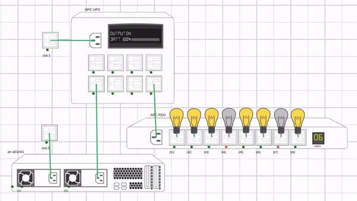

# SimEngine    

SimEngine is a simulation platform that can model high-availability hardware systems. The project itself supports web-based interface as well as a set of command line tools. SimEngine users can trigger power events through the dashboard or script commands to simulate certain conditions. The platform was developed with open-source community in mind and it is capable of modelling any high-availability setup meaning it can be potentially used by anyone specializing in high-availability industry.

SimEngine features include:

-   System modelling & power connections (PDU, UPS, Servers & VM control)
-   Power events (wallpower, assets' states, UPS battery etc)
-   IPMI/BMC interface and SNMP simulation (load, power etc.)
-   Thermal simulation (AC & Ambient, temperature sensors)
-   storcli64 simulation (Drive/CacheVault failure, temperature behaviour etc.)

Full project documentation is hosted on [readthedocs](https://simengine.readthedocs.io/en/latest)

### Project Structure

`./dashboard` - simengine frontend

`./docs` - project documentation

`./enginecore` - decision engine

`./rpm` - RPM packaging

`./services` - enginecore daemon service

### Installation process

If we navigate to the `simengine/setup/install-simengine` directory and we execute the `./execute` script the installation process will do all of the work.

### Notes

Vendor specific MIB files are not to be included under GPL-3.0 of this project, check with appropriate hardware vendors for additional information.

### License

This project is licensed under GPL-v3 (see [LICENSE](./LICENSE.txt))
