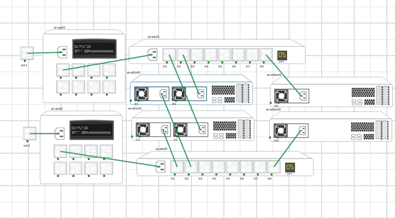

# Anvil Model

Simengine can support various topology layouts; In this section we will attempt to model [alteeve’s](https://www.alteeve.com/c/) high-availability system called _Anvil_ which consists of 2 striker dashboard machines, 2 target servers with IPMI interface, 2 PDUs, 2 Switches and 2 UPSes. High-level system map can be found on alteeve’s wiki [page](https://www.alteeve.com/w/Build_an_m2_Anvil!#Logical_Map.3B_Hardware_And_Plumbing).

This table summarizes the general layout of the `simengine` system model we are going to configure:

| **key** | **Name**     | **Type**   | **Address**                                          | **Interface**  |
| ------- | ------------ | ---------- | ---------------------------------------------------- | -------------- |
| 1       | outlet-1     | outlet     |                                                      |                |
| 2       | outlet-2     | outlet     |                                                      |                |
| 3       | ups01        | ups        | SNMP → reachable at 10.20.3.1 (default port 161)     | bcn1_bridge1:1 |
| 4       | ups02        | ups        | SNMP → reachable at 10.20.3.2                        | bcn1_bridge1:2 |
| 5       | pdu01        | pdu        | SNMP → reachable at 10.20.2.1                        | bcn1_bridge1:3 |
| 6       | pdu02        | pdu        | SNMP → reachable at 10.20.2.2                        | bcn1_bridge1:4 |
| 7       | an-a01n01    | server-bmc | IPMI → reachable at 10.20.11.1 (or from the VM)      | bcn1_bridge1:5 |
| 8       | an-a01n02    | server-bmc | IPMI → reachable at 10.20.11.2 (or from the VM)      | bcn1_bridge1:6 |
| 9       | an-striker01 | server     |                                                      |                |
| 10      | an-striker02 | server     |                                                      |                |


`an-a01n01` and `an-a01n02` are two managed servers whereas `an-striker01` and `an-striker02` are two nodes running control software "Striker Dashboard". 

4 VMs will be running so the host machine should preferably have more than 4 cores (ideally, `500GB` available disk space, `8` CPU cores and `32GB` memory).

## VM

4 VMs will be managed by the simulation engine — `an-a01n01` & `an-a01n02` will be running Fedora 28 and striker dashboards (`an-striker01` & `an-striker02`) will be hosted on CentOS-based system.

```bash
[root@host enginecore]$ virsh list --all
Id    Name                           State
----------------------------------------------------
-     an-a01n01                      shut off
-     an-a01n02                      shut off
-     an-striker01                   shut off
-     an-striker02                   shut off
```

The installation of the VMs plus minor setup need to be performed prior to the system modelling stage. You can use the official 'anvil-generate-iso' tool to create striker dashboards (see [An!Wiki page](https://www.alteeve.com/w/Build_the_Anvil!_m2_Install_Media) for more details).

**Resources**

For hardware resources, it is recommended to allocate:

Memory:

*  `8192 MiB` per each `an-a01n0x` node
*  `1024 MiB` per each `an-striker0x` control server

Storage:

*  `100 Gib` per each `an-a01n0x` node
*  `50 Gib` per each `an-striker0x` control server


### BMC and storcli64

Since 2 VMs ( `an-a01n01` & `an-a01n02` ) will support BMC/IPMI interface and storcli64, we will need to have lanplus interface and qemu options configured;

Once you install the target operating systems, shut down the VMs and configure `.xml` args as following:

**an-a01n01**

Update `.xml` configurations:

`sudo virsh edit an-a01n01`

You will need to change the top-level tag to `<domain type='kvm' xmlns:qemu='http://libvirt.org/schemas/domain/qemu/1.0'>` and also add `qemu` command line arguments (after `</devices>`):

```xml
 <qemu:commandline>
    <qemu:arg value='-chardev'/>
    <qemu:arg value='socket,id=ipmi0,host=127.0.0.1,port=9002,reconnect=2'/>
    <qemu:arg value='-device'/>
    <qemu:arg value='ipmi-bmc-extern,id=bmc0,chardev=ipmi0'/>
    <qemu:arg value='-device'/>
    <qemu:arg value='isa-ipmi-bt,bmc=bmc0'/>
    <qemu:arg value='-serial'/>
    <qemu:arg value='mon:tcp::9012,server,telnet,nowait'/>
    <qemu:arg value='-chardev'/>
    <qemu:arg value='socket,id=simengine-storage-tcp,host=localhost,port=50000,reconnect=2'/>
    <qemu:arg value='-device'/>
    <qemu:arg value='virtio-serial'/>
    <qemu:arg value='-device'/>
    <qemu:arg value='virtserialport,chardev=simengine-storage-tcp,name=systems.cdot.simengine.storage.net'/>
  </qemu:commandline>
```

**an-a01n02**

Almost identical steps need to be performed for the second VM (note that ipmi socket is assigned a different port this time (`port=9102`) which we will later pass as one of the command line arguments to `simengine-cli`).

`sudo virsh edit an-a01n02`

Change the top-level tag to `<domain type='kvm' xmlns:qemu='http://libvirt.org/schemas/domain/qemu/1.0'>` , add `qemu` command line arguments (after `</devices>`) as following:

```xml
<qemu:commandline>
    <qemu:arg value='-chardev'/>
    <qemu:arg value='socket,id=ipmi0,host=127.0.0.1,port=9102,reconnect=2'/>
    <qemu:arg value='-device'/>
    <qemu:arg value='ipmi-bmc-extern,id=bmc0,chardev=ipmi0'/>
    <qemu:arg value='-device'/>
    <qemu:arg value='isa-ipmi-bt,bmc=bmc0'/>
    <qemu:arg value='-serial'/>
    <qemu:arg value='mon:tcp::9012,server,telnet,nowait'/>
    <qemu:arg value='-chardev'/>
    <qemu:arg value='socket,id=simengine-storage-tcp,host=localhost,port=50001,reconnect=10'/>
    <qemu:arg value='-device'/>
    <qemu:arg value='virtio-serial'/>
    <qemu:arg value='-device'/>
    <qemu:arg value='virtserialport,chardev=simengine-storage-tcp,name=systems.cdot.simengine.storage.net'/>
  </qemu:commandline>
```

**storcli64**

You will need to upload `storcli64` binary to the target vms (`an-a01n01` and `an-a01n02`) bin folder `/usr/bin` and make them executable by running `chmod +x /usr/bin/storcli64`.

The binary can be found in simengine repo: [link](https://github.com/Seneca-CDOT/simengine/blob/master/storage-emulation-tests/guest/storcli64)


## Network Configuration

**Virtual Network**

You will need to define 4 virtual networks (`sn1_bridge1`, `sn2_bridge1` and `bcn1_bridge1`, `bcn2_bridge1`) using [net-define script](https://github.com/Seneca-CDOT/simengine/blob/master/enginecore/script/bridges) and configure virtual `NIC`s for the VMs;

***Using Virsh .XML***

One way to connect guests to the newly-defined interfaces is to copy `<interface>...</interface>` tags in `an-*.xml` vm config dump files located in [data folder](https://github.com/Seneca-CDOT/simengine/blob/master/data/virsh) and paste in xml configuration by running `virsh edit` for all 4 vms;

***Virt-Manager Tool (Alternative to Using Virsh .XML)***

Alternatively, you can use `virt-manager` GUI - double-click a vm and configure hardware in the `Show Virtual Hardware details` tab (lightbulb icon);

Each `an-a01n0x` vm will have 6 virtual network interfaces configured, whereas Striker systems `an-striker0x` will be using 2 virtual network interfaces.

`an-a01n0x` NAT (repeat this step for all anvil nodes):

1) Click `Add Hardware` and select `Network`

2) Select `default` NAT as "Network source"

3) Select `e1000` as its "Device Model"

4) Click finish and add another `NAT` nic using the steps outlined above

`an-a01n0x` Isolated network `sn1_bridge1` (repeat this step for all anvil nodes):

1) Click `Add Hardware` and select `Network`

2) Select `Virtual network sn1_bridge1` isolated network as "Network source"

3) Select `e1000` as its "Device Model"

4) Click finish and add another `Isolated Network` nic using the steps outlined above

`an-a01n0x` Isolated network `bcn1_bridge1` (repeat this step for all anvil nodes):

1) Click `Add Hardware` and select `Network`

2) Select `Virtual network bcn1_bridge1` isolated network as "Network source"

3) Select `e1000` as its "Device Model"

4) Click finish and add another `Isolated Network` nic using the steps outlined above

`an-striker0x` NAT (repeat this step for all striker nodes):

1) Click `Add Hardware` and select `Network`

2) Select `default` NAT as "Network source"

3) Select `e1000` as its "Device Model"

`an-striker0x` Isolated network `bcn1_bridge1` (repeat this step for all striker nodes):

1) Click `Add Hardware` and select `Network`

2) Select `Virtual network bcn1_bridge1` isolated network as "Network source"

3) Select `e1000` as its "Device Model"

**Host Network**

We will need to allocate IP addresses for the SNMP simulators on the host machine (machine that will run `simengine`). In this example, we will temporarily add network interfaces and assign IP addresses:

```bash
ifconfig bcn1_bridge1:1 10.20.3.1/16
ifconfig bcn1_bridge1:1 netmask 255.255.0.0

ifconfig bcn1_bridge1:2 10.20.3.2/16
ifconfig bcn1_bridge1:2 netmask 255.255.0.0

ifconfig bcn1_bridge1:3 10.20.2.1/16
ifconfig bcn1_bridge1:3 netmask 255.255.0.0

ifconfig bcn1_bridge1:4 10.20.2.2/16
ifconfig bcn1_bridge1:4 netmask 255.255.0.0

ifconfig bcn1_bridge1:5 10.20.11.1/16
ifconfig bcn1_bridge1:5 netmask 255.255.0.0

ifconfig bcn1_bridge1:6 10.20.11.2/16
ifconfig bcn1_bridge1:6 netmask 255.255.0.0
```

!!! note
    You may need to re-configure your firewall and expose port 161 (SNMP) as well as port 623 (IPMI) to the striker systems.
    e.g.
    ```bash
    $ iptables -I INPUT -p udp -m udp --dport 161 -j ACCEPT
    $ iptables -I INPUT -p udp -m udp --dport 623 -j ACCEPT
    ```

!!! note
    Network assignment will be lost on system reboot, make sure to run the script on system start


## System Model

At this stage, we should be ready to model our high-availability hardware topology. Drop the existing model in case the data store is not empty:

`simengine-cli model drop`

And pause the engine daemon:

`sudo systemctl stop simengine-core`

Running the source code below should re-create the Anvil topology; `model create` will add new assets to the data store & `model power-link` will link assets together:

```bash
# Create 2 outlets, one powers 'an-ups01' another one powers 'an-ups02'
simengine-cli model create outlet --asset-key=1 -x=-861 -y=-171
simengine-cli model create outlet -k2 -x=-861 -y=351

# Add 2 UPSs
simengine-cli model create ups -k=3 \
    --name=an-ups01 \
    --host=10.20.3.1 \
    --mask=255.255.0.0 \
    --port=161 \
    --interface="bcn1_bridge1:1" \
    --serial-number="SVPD4D5QTQ3V" \
    --mac-address="f2325a5b0824" \
    -x=-895 -y=-182
simengine-cli model create ups -k=4 \
    --name=an-ups02 \
    --host=10.20.3.2 \
    --mask=255.255.0.0 \
    --port=161 \
    --interface="bcn1_bridge1:2" \
    --serial-number="8IAIMD9RX6KZ" \
    --mac-address="8117f9db70d4" \
    -x=-895 -y=347

# Create 2 PDUs
simengine-cli model create pdu -k=5 \
    -n=an-pdu01 \
    --host=10.20.2.1 \
    --mask=255.255.0.0 \
    --port=161 \
    --interface="bcn1_bridge1:3" \
    --serial-number="AQ5AKU1OORAX" \
    --mac-address="37436ab3c583" \
    -x=-36 -y=-161

simengine-cli model create pdu -k=6 \
    -n=an-pdu02 \
    --host=10.20.2.2 \
    --mask=255.255.0.0 \
    --port=161 \
    --interface="bcn1_bridge1:4" \
    --serial-number="95SQW45SVIFX" \
    --mac-address="b7bc37aa4d83" \
    -x=-36 -y=567

# Add 2 Servers
simengine-cli model create server-bmc -k=7 \
    --domain-name=an-a01n01 \
    --power-consumption=360 \
    -x=-162 -y=320 \
    --host=10.20.11.1 \
    --port=623 \
    --interface="bcn1_bridge1:5"
simengine-cli model create server-bmc -k=8 \
    --domain-name=an-a01n02 \
    --power-consumption=360 \
    --host=10.20.11.2 \
    --port=623 \
    --vmport=9102 \
    --storcli-port=50001 \
    -x=-171 -y=86 \
    --interface="bcn1_bridge1:6"

# Add 2 Striker Servers
simengine-cli model create server -k=9 --domain-name=an-striker01 --power-consumption=240 --psu-num=1 -x=738 -y=101
simengine-cli model create server -k=10 --domain-name=an-striker02 --power-consumption=240 --psu-num=1 -x=734 -y=326

### Power Components
# connect outlets & UPSs
simengine-cli model power-link -s1 -d3   # {_Mains_}==>[an-ups01]
simengine-cli model power-link -s2 -d4   # {_Mains_}==>[an-ups02]

# connect ups & pdus
simengine-cli model power-link -s31 -d5  # [an-ups01]==>[an-pdu01]
simengine-cli model power-link -s41 -d6  # [an-ups02]==>[an-pdu02]

# Power up servers
simengine-cli model power-link -s51 -d72 # [an-pdu01]={port-1}=>{psu-2}=>[an-a01n01]
simengine-cli model power-link -s52 -d82 # [an-pdu01]={port-2}=>{psu-2}=>[an-a01n02]

simengine-cli model power-link -s61 -d71 # [an-pdu02]={port-1}=>{psu-1}=>[an-a01n01]
simengine-cli model power-link -s62 -d81 # [an-pdu02]={port-2}=>{psu-1}=>[an-a01n02]

# Power Up Striker Servers
simengine-cli model power-link -s58 -d91  # [an-pdu01]={port-8}=>{psu-1}=>[an-striker01]
simengine-cli model power-link -s68 -d101 # [an-pdu02]={port-8}=>{psu-1}=>[an-striker02]
```

Re-start the daemon:
`sudo systemctl start simengine-core`

You can verify that the simulators are running by issuing:

`ps aux | grep snmpsimd # should show 4 instances`

`ps aux | grep ipmi_sim # should show 2 instances`

## First Run

The front-end web-page will display assets in the following arrangement:



You can customize the layout by positioning the assets in the preferred way. Click on gear ⚙️ icon & choose ‘Save Layout’ to save new asset coordinates;


## Management

Make sure all 6 hardware assets (2 UPSes, 2 PDUs and 2 Anvil Nodes) are reachable from the striker servers `an-striker01` and `an-striker01` prior to launching installation step with the striker dashboard. Double check your firewall rules if both `snmpsimd` and `ipmi_sim` processes are running but network interfaces appear unavailable.

Once this step is completed, you can proceed to [building anvil cluster](https://www.alteeve.com/w/Build_an_m2_Anvil!).

**UPS**

UPSes’ SNMP interface can be reached at `10.20.3.1` & `10.20.3.2`

For example:

`snmpwalk -Cc -c public -v 1 10.20.3.1 .1.3.6.1.4.1.318.1.1.1.2.2`

`snmpwalk -Cc -c public -v 1 10.20.3.2 .1.3.6.1.4.1.318.1.1.1.2.2`

More documentation on UPS management can be found here: [link](https://simengine.readthedocs.io/en/latest/AssetsConfigurations/#ups);

**PDU**

PDUs SNMP interface is accessible at `10.20.2.1` & `10.20.2.2`

For example:

`snmpwalk -Cc -c public -v 1 10.20.2.1`

`snmpwalk -Cc -c public -v 1 10.20.2.2`

**Server-BMC**

Servers that support BMC interface can be accessed from both host machine & the VMs:

Running from host example:

`ipmitool -H 10.20.11.1 -U ipmiusr -P test sdr list # server 7 (an-a01n01)`

`ipmitool -H 10.20.11.2 -U ipmiusr -P test sdr list # server 8 (an-a01n02)`

Or inside anvil VMs:

`sudo ipmitool sdr list`

**storcli64**

You can test `storcli64` from one of the vms (`an-a01n01` or `an-a01n02`) by running:

`storcli64 /c0 show all`

**Power Management**

You can retrieve status of individual assets by issuing:

`simengine-cli status -k1 # is out-1 up?`

And power them up/down:

`simengine-cli power down -k1 # out-1 is down`

More information on asset management including storage and thermal relationships can be found here: [link](./Asset%20Management);

**Model Updates**

You can update the existing model (for example, update UPS snmp ip address or server’s power consumption);

!!! note
    Any model changes require `simengine-core` service restart;

see `simengine-cli model update` for more information;
