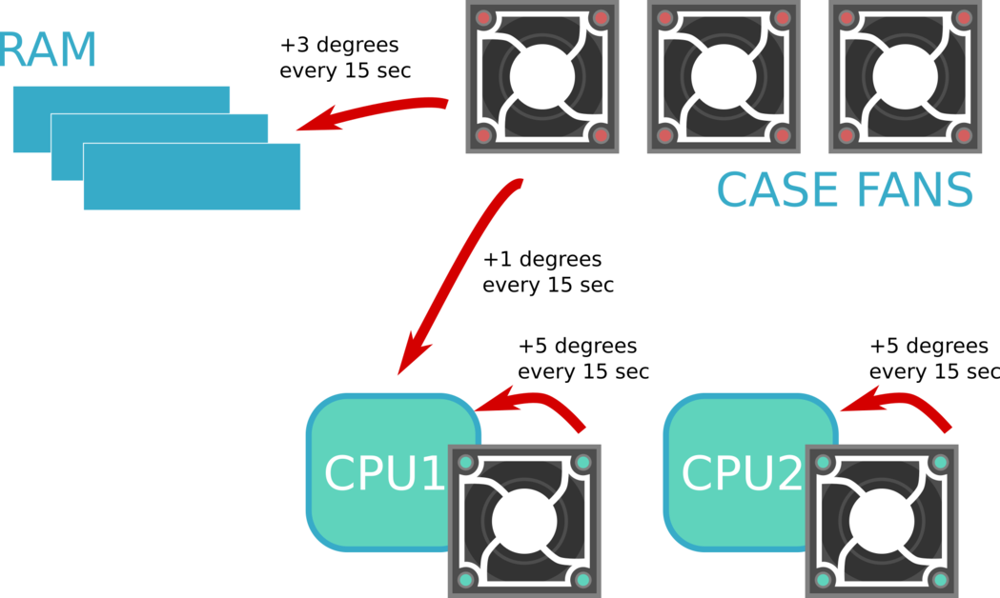

## Agents 

You can check if ipmi/snmp simulators are up & running by issuing status command:

`simengine-cli status --asset-key={key} --agent`

## Power Management

Power can be managed though either UI or `simengine-cli`, for example:

### ON

`simengine-cli power on -k1` 

will power asset under key `1`.

### OFF

You can power asset off with `power down` command:

`simengine-cli power down -k1` 

### Status

You can get assets' status with `simengine-cli status` (this will also dislay load).

### UI

UI presents a toggle option that can change asset's status to either on or off. Click on any component and check the `Toggle Status` to update the state.

### IPMI-enabled Server

You can also use `ipmitool` to communicate commands to the ipmi simulator instance:

`ipmitool -H localhost -p 9001 -U ipmiusr -P test power status`

`ipmitool -H localhost -p 9001 -U ipmiusr -P test power off`

`ipmitool -H localhost -p 9001 -U ipmiusr -P test power on`

`ipmitool -H localhost -p 9001 -U ipmiusr -P test power cycle`

### Wall Power

You can control the mains with the following commands: 

`simengine-cli power outage` 

`simengine-cli power restore` 

Running this will power down all the electrical outlets and switch off AC.

## Thermal Simulation

Simengine can emulate thermal conditions such as room temperature & AC, internal server heating/cooling behaviour. ‘Out-of-the-box’ system will be defaulted to a rather limited state so some advance thermal operations (e.g. sensor interrelationship) will need to be configured by the simengine user.

### Ambient

Ambient is affected by the virtual AC configurations and can rise/fall depending on the wall power state. 

Ambient (room temperature) can be queried as: 

`simengine-cli thermal ambient get`

This command will report current room temperature value as well as the AC settings:

    Ambient: 21.0° 
    AC settings:
     -> [online]  : decrease by 1°/20 sec, until 21° is reached
     -> [offline] : increase by 1°/20 sec, until 28° is reached 

The last 2 lines summarize ambient behaviour upon AC state changes where, for instance, working AC (`[online]`) should cool down virtual system environment by 1° every 20 seconds until 21° degrees is reached. 

You can set ambient to 28° (note that AC will start cooling down the system immediately according to the configurations):

`simengine-cli thermal ambient set --degrees=28`

Or change AC behaviour (on AC going offline in this case):

`simengine-cli thermal ambient set --rate=2 --degrees=1 --pause-at=28 --event=down`

AC is affected by the mains state (power outage or restoration), for instance, running this command should result in room temperature rising:

`simengine-cli power outage` 

### Sensor Interrelationship

Some server parts can have thermal impact on others e.g.,  a case fan will be cooling its neighbouring server components (CPU, memory etc.) whereas a working PSU may cause the opposite effect.

You can query all thermal relationships for a particular server:

`simengine-cli thermal sensor get --asset-key=5`

Or select a specific sensor:

`simengine-cli thermal sensor get --asset-key=5 --sensor='Frnt_FAN2``'`

### Configuring Interrelationships

The command-line interface exposes tools for modelling thermal relationships between server parts. You can configure one connection at a time and provide source (sensor causing thermal impact) and target (affected sensor) names as well as event and action details. Event is used to determine when to trigger or enable thermal action (e.g. on source event going ‘offline’) and action indicates whether target sensor value should be increased or decreased.

For example, this CLI command:

    simengine-cli thermal sensor set \
            --asset-key=5 \
            --source-sensor='Frnt_FAN2' \
            --target-sensor='Mem E' \
            --event=up \
            --action=decrease \
            --rate=5 \
            --degrees=1 \
            --pause-at=21

will set ‘Frnt_FAN2’ to cool down ‘Mem E’ temperature every 5 seconds by 1°. 

Note : most thermal cases require both ‘up’ and ‘down’ events configured
(‘Frnt_FAN2’ going down should result in temperature spikes for Memory slot(s)). 

### Model-Based Relationship

The configuration outlined in the previous section results in a binary behaviour where the source sensor is either on or off (any positive value/0). Simengine supports a model-based thermal configuration that requires a JSON formatted source-target mappings.

model.json (RPM value mapped to degrees): 

    {
      "400": 1, 
      "600": 2, 
      "1200": 3  
    }

Configure thermal relationship using the model: 

     simengine-cli thermal sensor set \
        --asset-key=5 \
        --source-sensor='Frnt_FAN1' \
        --target-sensor='Mem E'\
        --action=decrease \
        --rate=3 \
        --pause-at=21 \
        --model="$(cat ./model.json)"

### Sensors and CPU Usage

It is also possible to set a relationship between cpu load of the virtual machine SimEngine is running and certain IPMI sensors (e.g. `CPU Temperature`):

    simengine-cli thermal cpu-usage set \
      --target-sensor='CPU2 temperature' \
      --model='{"10": 1, "20": 4, "80": 5}' \
      --asset-key=5

The ‘model’ consists of mappings of cpu load to thermal impact e.g., at cpu load 10%, 1° will be added 'CPU2 temperature’.

You can query cpu load configurations with:

`simengine-cli thermal cpu-usage get --asset-key=5`  

    Server [5]:
     --> t:[CPU1 temperature] using model '{"10": 1, "20": 4, "80": 10}'

### Sensors and Storage Components

SimEngine's `storcli64` emulator outputs temperature readings associated with CacheVault and physical drives. Sensor/hard drive components’ interrelationships can be configured similar to sensor/sensor interrelationships.

For instance, this command creates a thermal connection between cache vault (under serial number 17703) and `PSU1 Power` bmc sensor:

    simengine-cli thermal storage set \
      --asset-key=5 \
      --source-sensor='PSU1 power' \
      --event=up \
      --action=increase \
      --rate=1 \
      --degrees=1 \
      --pause-at=28 \
      --controller=0 \
      --cache-vault=17703
    
    simengine-cli thermal storage set \
      --asset-key=5 \
      --source-sensor='PSU1 power' \
      --event=down \
      --action=decrease \
      --rate=1 \
      --degrees=1 \
      --pause-at=28 \
      --controller=0 \
      --cache-vault=17703
    

You can also make bmc sensor ‘target’ a physical drive. The following configuration will make a physical drive 9 cool down when upstream power is not present (PSU2 is offline).

    simengine-cli thermal storage set \
      --asset-key=5 \
      --source-sensor='PSU2 power' \
      --event=up \
      --action=increase \
      --rate=1 \
      --degrees=1 \
      --pause-at=28 \
      --controller=0 \
      --drive=9
    
    simengine-cli thermal storage set \
      --asset-key=5 \
      --source-sensor='PSU2 power' \
      --event=down \
      --action=decrease \
      --rate=1 \
      --degrees=1 \
      --pause-at=28 \
      --controller=0 \
      --drive=9
    

## Storage Simulation

 
SimEngine supports a built-in `storcli64` simulator that can reconstruct core storage behaviour. The Storage Command Line Tool (StorCLI) is the command line management software designed for the MegaRAID® product line. SimEngine’s `storcli64` simulator accepts query(read)-only cli commands limited to [alteeve’s](https://www.alteeve.com/c/) Anvil! platform requirements at the moment. 

**Commands**

| **storcli64 command**                | **Details**        |
|--------------------------------------|--------------------------------------- |
| `storcli64 /c0 show perfmode`        | Show performance mode  |
| `storcli64 /c0 show bgirate`         | Background Initialization (BGI) is an automated process that writes the parity or mirrors data on newly created virtual disks.  Defined at the model creation in [storage.json](https://github.com/Seneca-CDOT/simengine/blob/master/enginecore/enginecore/model/presets/storage.json) as “bgiRate” |
| `storcli64 /c0 show ccrate`          | The CC (Check Consistency) Rate determines the rate at which consistency check scans are performed on a disk to determine if data is corrupted.   Defined at the model creation in [storage.json](https://github.com/Seneca-CDOT/simengine/blob/master/enginecore/enginecore/model/presets/storage.json) as “ccRate” |
| `storcli64 /c0 show rebuildrate`     | Hard drive rebuild rate for a RAID Controller  Defined at the model creation in [storage.json](https://github.com/Seneca-CDOT/simengine/blob/master/enginecore/enginecore/model/presets/storage.json) as “ccRate” |
| `storcli64 /c0 show prrate`          | Patrol Read Rate for a RAID Controller  Defined at the model creation in [storage.json](https://github.com/Seneca-CDOT/simengine/blob/master/enginecore/enginecore/model/presets/storage.json) as “prRate”  |
| `storcli64 /c0 show alarm`           | Display alarm state for a RAID Controller  Can be set to either `on/off/missing` with: `simengine-cli storage controller set --asset-key=5 --controller=0 --alarm-state=on` |
| `storcli64 /c0 show all`             | A RAID controller is a hardware device or software program used to manage hard disk drives in a computer or storage array.  Some controller-associated properties, such as `Memory Correctable Errors` and `Memory Uncorrectable Errors` can be set with `simengine-cli`  see `simengine-cli storage controller set -h` for more details. |
| `storcli64 /c0 /bbu show all`        | Show BBU details (Backup Battery Unit supporting cache for up to 72 hours until a machine is brought back on line) |
| `storcli64 /c0 /cv show all`         | Display cache vault (flash-based cache protection).  Replacement status can be updated with:  `simengine-cli storage cv set --asset-key=5 --controller=0 --replacement-required="Yes"`  Sometimes cache vault fails to change its mode to `WriteThrough` (this may result in data loss): `simengine-cli storage cv set --asset-key=5 --controller=0 --write-through-fail` |
| `storcli64 /c0 /vall show all`       | Display virtual drives  Virtual drive states will change depending on [storage_state.json](https://github.com/Seneca-CDOT/simengine/blob/master/enginecore/enginecore/model/presets/storage_states.json) definition file and current status of physical drives or other storage components.  For example with out-of-the-box settings, virtual drive state will be set to `Pdgd` (partially degraded) if one of the physical drives belonging to the virtual space is set offline:  `simengine-cli storage pd set --asset-key=5 --controller=0 --drive-id=7 --state=Offln` |
| `storcli64 /c0 /eall /sall show all` | Display physical drives  Error counts, such as `Media Error Count`, `Other Error Count` and `Predictive Error Count` are settable (see `simengine-cli storage pd set -h`)  Drive state can be set to either `Onln` or `Offln`: `simengine-cli storage pd set --asset-key=5 --controller=0 --drive-id=7 --state=Offln` |

##  Playback Scenarios 

You can register your own scripts with `simengine-cli` and execute them through either `cli` or SimEngine dashboard:

    # Provide a folder SimEngine would register scripts from 
    simengine-cli play folder --path='~/dev/plays'
    ls ~/dev/plays
          outlet_test.sh   # bash (simengine-cli)
          pdu_test.py      # using python api
    
    # execute a script
    simengine-cli play execute outlet_test
