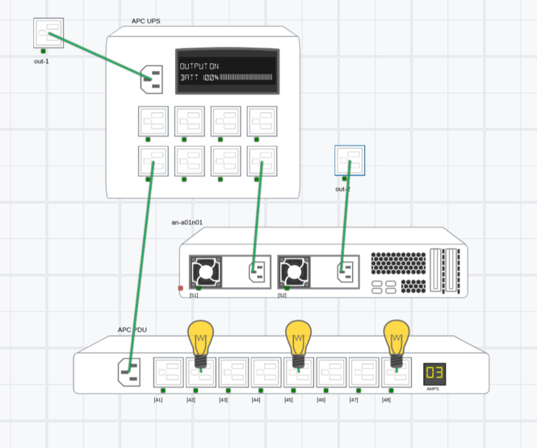

# System Modelling

`simengine-cli` provides interface for making your own system model (run `simengine-cli model --help` for more information).
There're 6 supported asset types at the moment: Outlet, PDU, UPS, Server, Server with BMC (IPMI interface) and Static Device (dummy asset). The CLI type options can be found under `simengine-cli model create -h`.

!!! note
    Main engine daemon will need to be reloaded before schema changes can take place (any `simengine model` commands require `simengine-core` restart).

The first time you load the model in a web interface, the assets are going to be overlaid on top of each other. You will need to create your own layout by dragging the components around, clicking `Gear` icon located in the top bar and saving it by choosing `Save Layout` option.

Note that the UI does not support system modelling tools at the moment.

## Create

You can create a new asset with `model create` and power it by another asset with `model power-link`, The simplest example would be a model that is composed of a single pdu powered by an outlet:

    simengine-cli model create outlet --asset-key=1
    simengine-cli model create pdu --asset-key=2 --port=1024
    simengine-cli model power-link --source-key=1 --dest-key=2

The code snippet below will create more complicated system that includes a UPS, a PDU, one server managing a VM and 3 lamps powered by the PDU.

!!! note
    You need to have a libvirt vm with a domain name 'an-a01n01'



Source Code:

```bash
# 2 outlets
simengine-cli model create outlet -k1 -x=-200 -y=-237
simengine-cli model create outlet -k2 -x=632 -y=115

# 1 UPS, 1 PDU
simengine-cli model create ups -k3 --port=1024 -x=-165 -y=-113
simengine-cli model create pdu -k4 --port=1025 -x=31 -y=700

# 1 server (VM named 'an-a01n01')
simengine-cli model create server-bmc -k5 --domain-name=an-a01n01 --power-consumption=480 -x=175 -y=416 --no-power-on-ac

# Add 3 lamps
simengine-cli model create lamp -k62 --power-consumption=120 -x=223 -y=595
simengine-cli model create lamp -k65 --power-consumption=120 -x=493 -y=595
simengine-cli model create lamp -k68 --power-consumption=120 -x=764 -y=594


# Plug-in devices (create power connections)
simengine-cli model power-link -s1 -d3    # out to ups

simengine-cli model power-link -s35 -d4   # ups to pdu
simengine-cli model power-link -s38 -d51  # ups to server

simengine-cli model power-link -s2 -d52   # out to server

simengine-cli model power-link -s42 -d62  # pdu to lamp
simengine-cli model power-link -s45 -d65  # pdu to lamp
simengine-cli model power-link -s48 -d68  # pdu to lamp
```

## Connecting Devices

Code snippet below will create a power link between asset under key 1 & asset under key 2 (meaning source '1' will power destination '2')

`simengine-cli model power-link --source-key=1 --dest-key=2`

It is also possible to delete an existing power connection:

`simengine-cli model power-link -s=1 -d=2 --remove`

### Linking Schema

PDU: if **input** outlet has key 1, **output** outlets will be assigned 11, 12, 13, 14, 15 ... 1n ('n' -> number of outlets)

UPS: if **input** outlet has key 1, **output** outlets will be assigned 11, 12, 13, 14, 15 ... 1n ('n' -> number of outlets)

Server: if server asset key is 1, **input** PSU outlets will be assigned 11, 12 (if dual PSU is enabled)

## Update

Some properties can be configured later as in this example:

`simengine-cli model update pdu -k1113 --off-delay=3000 # set power-off delay as 3000 ms`

SNMP OID configurations (oid mappings), PSU settings & outlet count cannot be updated after asset's creation; Howerver, you can delete the existing asset, add a new one and recreate its power connections;

See `simengine-cli model update {asset_type} -h` for the list of supported properties and [Assets Configurations](./Assets%20Configurations) page for more detailed documentation.

!!! note
    The main engine daemon will need to be reloaded before schema changes can take place.

## Delete Asset

You can also remove & detach specific assets by key:

`simengine-cli model delete --asset-key=1113`

!!! note
    You may need to re-connect some components afterwards since the power-link may be broken

## Drop Topology

The entire system topology can be deleted with `simengine-cli model drop` command
