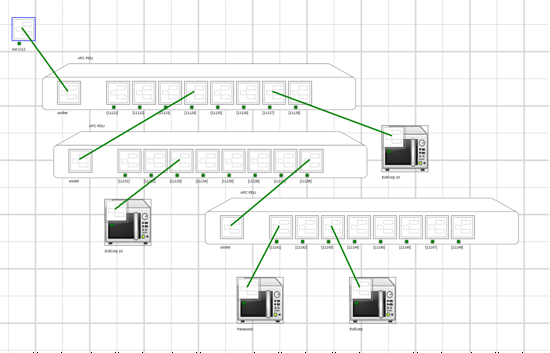

# System Modelling

`simengine-cli` provides interface for making your own system model (run `simengine-cli model --help` for more information). You can also define the system topology directly through `cypher`  & `neo4j` (see examples in `topologies` folder).
There're 6 supported asset types at the moment: Outlet, PDU, UPS, Server, Server with BMC (IPMI interface) and Static Device (dummy asset). The CLI type options can be found under `simengine-cli model create -h`.

*Note* that the main engine daemon will need to be reloaded before schema changes can take place (any `simengine model` commands require `simengine-core` restart).

The first time you load the model in a web interface, the assets are going to be overlaid on top of each other. You will need to create your own layout by dragging the components around, clicking `Gear` icon located in the top bar and saving it by choosing `Save Layout` option.

Note that the UI does not support system modelling tools at the moment.

## Create

You can create a new asset with `model create` and power it by another asset with `model power-link`, The simplest example would be a model that is composed of a single pdu powered by an outlet:

    simengine-cli model create outlet --asset-key=1
    simengine-cli model create pdu --asset-key=2 --port=1024
    simengine-cli model power-link --source-key=1 --dest-key=2

The code snippet below will create more complicated system that includes 3 PDUs and some static assets drawing power from the power distribution devices.

Source Code:

    # Create an Outlet
    simengine-cli model create outlet --asset-key=1111
    
    # Create 3 PDUs
    simengine-cli model create pdu --asset-key=1112 --port=1024
    simengine-cli model create pdu --asset-key=1113 --port=1025
    simengine-cli model create pdu --asset-key=1114 --port=1026
    
    # Add bunch of microwaves (4 items)
    simengine-cli model create static --asset-key=2011 --name='Panasonic' --img-url=http://z3central.cdot.systems/docs/microwave-159076_640.png --power-source=120 --power-consumption=600
    simengine-cli model create static --asset-key=2012 --name='EvilCorp' --img-url=http://z3central.cdot.systems/docs/microwave-159076_640.png --power-source=120 --power-consumption=600
    simengine-cli model create static --asset-key=2013 --name='EvilCorp 10' --img-url=http://z3central.cdot.systems/docs/microwave-159076_640.png --power-source=120 --power-consumption=600
    simengine-cli model create static --asset-key=2014 --name='EvilCorp 10' --img-url=http://z3central.cdot.systems/docs/microwave-159076_640.png --power-source=120 --power-consumption=600
    
    # Linking Assets Together
    simengine-cli model power-link --source-key=1111 --dest-key=1112
    simengine-cli model power-link --source-key=11124 --dest-key=1113
    simengine-cli model power-link --source-key=11138 --dest-key=1114
    simengine-cli model power-link --source-key=11141 --dest-key=2011
    simengine-cli model power-link --source-key=11143 --dest-key=2012
    simengine-cli model power-link --source-key=11133 --dest-key=2013
    simengine-cli model power-link --source-key=11127 --dest-key=2014

## Link

Code snippet below will create a power link between asset under key 1 & asset under key 2 (meaning source '1' will power destination '2')

`simengine-cli model power-link --source-key=1 --dest-key=2`

It is also possible to delete an existing power connection:

`simengine-cli model power-link -s=1 -d=2 --remove`

### Linking Schema

PDU: if __input__ outlet has key 1, __output__ outlets will be assigned 11, 12, 13, 14, 15 ... 1n ('n' -> number of outlets)

UPS: if __input__ outlet has key 1, __output__ outlets will be assigned 11, 12, 13, 14, 15 ... 1n ('n' -> number of outlets)

Server: if server asset key is 1, __input__ PSU outlets will be assigned 11, 12 (if dual PSU is enabled)

## Update

Some properties can be configured later as in this example:

`simengine-cli model update pdu -k1113 --off-delay=3000 # set power-off delay as 3000 ms`

SNMP OID configurations (oid mappings), PSU settings & outlet count cannot be updated after asset's creation; Howerver, you can delete the existing asset, add a new one and recreate its power connections; 

See `simengine-cli model update {asset_type} -h` for the list of supported properties and [Assets Configurations](./Assets%20Configurations) page for more detailed documentation. 

*Note* that the main engine daemon will need to be reloaded before schema changes can take place.

## Delete Asset

You can also remove & detach specific assets by key (note that you may need to re-connect some components afterwards since the power-link may be broken):

`simengine-cli model delete --asset-key=1113`

## Drop Topology

The entire system topology can be deleted with `simengine-cli model drop` command

